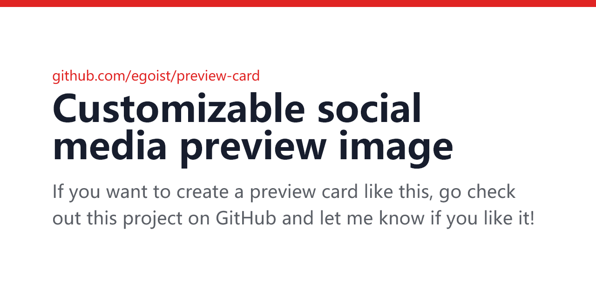

# @egoist/preview-card

Customizable social media preview image, like this one:



## Install

```bash
yarn add @egoist/preview-card
```

**NOTE: this module relies on Chrome (or Chromium) browser, make sure you have it installed on your machine before running this module**.

## Usage

```ts
import { getImage, stopBrowser } from '@egoist/preview-card'

const imageBuffer = await getImage({
  title: 'your title',
  description: 'your description',
  domain: 'your domain',
  themeColor: '#e02423', // optional
})

// Close the browser when you no longer need to use this module
await stopBrowser()
```

## Inspiration

Thanks to [Mugshot Bot](https://www.mugshotbot.com/) for the original design inspiration.

## License

MIT &copy; [EGOIST](https://github.com/sponsors/egoist)
